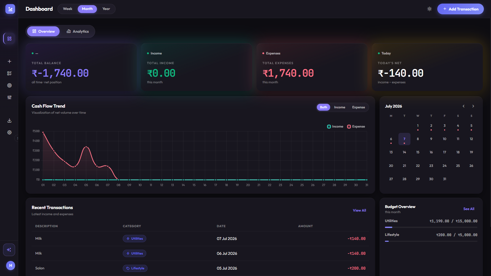
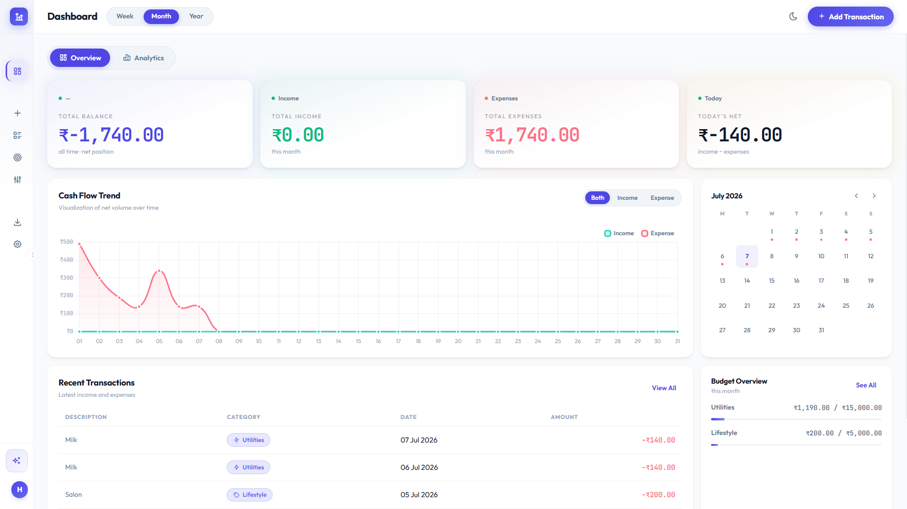
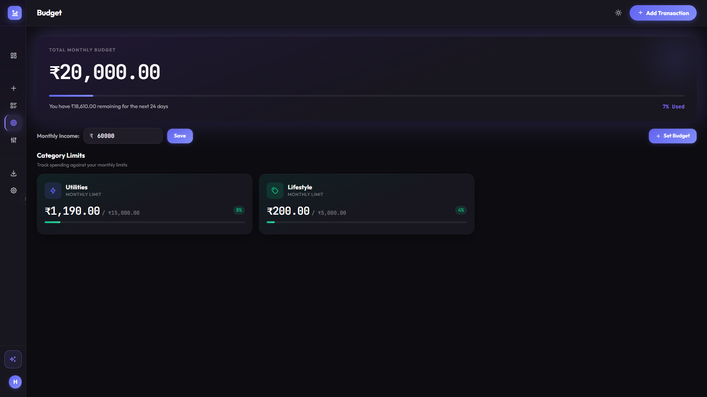
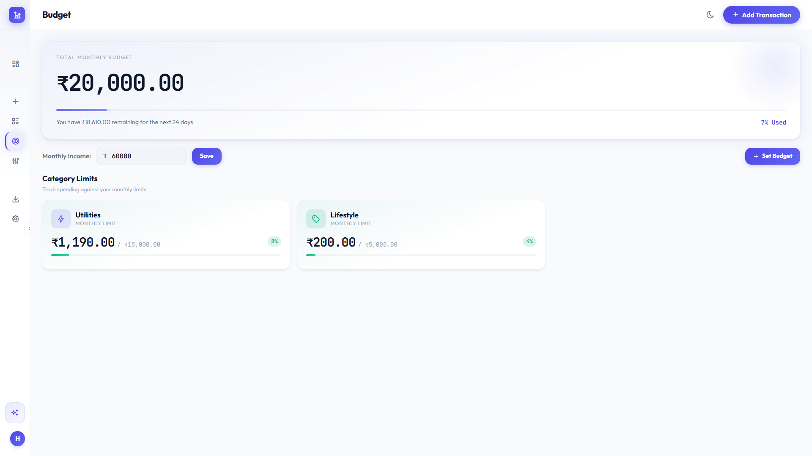
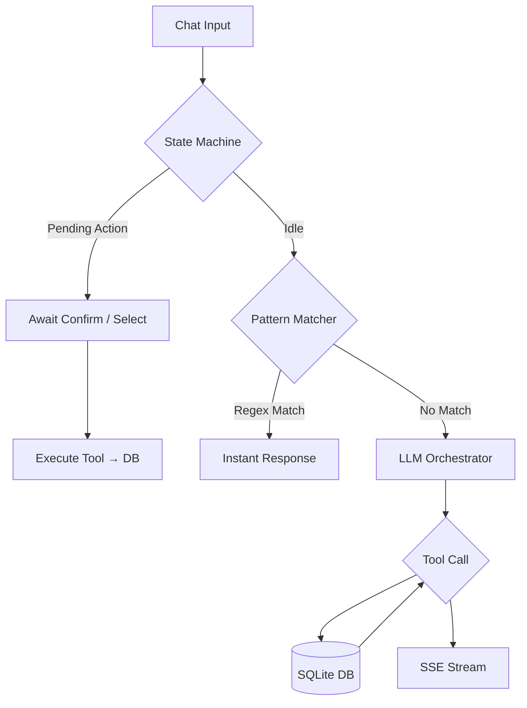

# 💸 FinOS
**The Intelligent Personal Finance Operating System**

[](https://www.python.org/downloads/)
[](https://fastapi.tiangolo.com)
[](https://sqlmodel.tiangolo.com)
[](https://console.groq.com)
[](https://opensource.org/licenses/MIT)

FinOS is not just an expense tracker. It is a full-stack AI finance platform that gives you two ways to interact with your money — a visual dashboard for passive overview, and a conversational AI agent for active querying. Both are always live. Neither depends on the other.

Built by unifying two prior projects — `expense-tracker` (CLI, JSON storage) and `finance-agent` (conversational AI) — into a single web application. This is not a rewrite. The agent logic, pattern matcher, tool schemas, and insights engine from `finance-agent` are carried forward. Only the storage layer (JSON → SQLite) and interface layer (CLI → Web) change.


## 🖥️ Application Preview

### 📊 Main Dashboard
The central hub displaying real-time cash flow trends, net positions, and recent transaction history.

| Dark Mode | Light Mode |
|---|---|
|  |  |

### 🎯 Budget Management
Advanced tracking to enforce daily quotas, set category-specific targets, and monitor limit thresholds.

| Dark Mode | Light Mode |
|---|---|
|  |  |

---

## ✨ Features

**Dual interaction model** — add a transaction by filling a form, or just tell the AI. Both paths write to the same database. The form takes zero LLM tokens. The AI takes one or two calls for complex queries, zero for simple ones.

**Conversational analytics** — ask things like "compare this month vs last month", "where is most of my money going?", or "am I overspending on food?". The agent streams its response word by word.

**Smart pattern matching** — roughly 60% of common queries ("balance", "show this week", "add 250 food") are intercepted before they reach the LLM and answered instantly via regex routing.

**Payment method tracking** — every transaction can be tagged with a payment method (Cash, Card, UPI, etc.), managed the same way as categories: user-defined, deletion blocked while in use, orphan-safe (renaming/deleting a method never breaks historical transactions — they keep the string).

**Budget tracking** — set per-category monthly limits, monitor usage with progress bars, and get toast-alerted when a category crosses 80% of its limit.

**Safe delete and update flows** — the agent traps all destructive actions in a confirmation state machine. It shows you what it's about to change and waits for explicit approval before touching the database.

**Financial insights** — six pattern detectors surface spending spikes, subscription creep, lifestyle inflation, weekend vs weekday patterns, time-of-month effects, and new category introductions — surfaced as dashboard cards, fixed monthly (independent of the week/month/year filter, since the underlying logic is inherently month-shaped).

**Spending forecast** — projects this month's total spend from a 3-month historical average, shown against current spend-so-far with a progress bar.

**Financial health score** — four independent sub-scores (savings rate, budget adherence, income stability, expense growth), each gracefully reporting "not enough data" instead of a misleading number when history is too thin.

**Export** — download your transaction history as CSV, JSON, or Excel (`.xlsx` with color-coded rows and styled headers).

**Hardened auth** — bcrypt password hashing, enforced username/password policy on both frontend and backend, in-app change-password, and a CLI-based password reset for lockouts (see [Auth & Security](#-auth--security) below).

**Sliding session expiry** — sessions stay alive for 4 hours of *active* use (refreshed on every authenticated request) rather than a hard cutoff, paired with a 30-minute client-side idle timer that signs out an inactive tab regardless of the server-side token's remaining life.

---

## 🖥️ Dashboard

The dashboard is a single destination — **Overview** and **Analytics** are tabs within it, not separate pages, so switching between "what's happening" and "why" never feels like leaving the app.

**Overview** — the at-a-glance view:
- Four metric cards (Total Balance, Income, Expenses, Today's Net)
- Cash Flow Trend line chart
- A compact mini-calendar in the right rail: dots mark days with transaction activity (green for a net-positive day, red for net-negative), no dot for empty days. Clicking a day reactively filters the Recent Transactions list below it in place — no modal, no page change. A "Clear" action returns to the default unfiltered view, and an inline "+ Add" shortcut pre-fills the Add Transaction form with the selected date.
- Budget Overview mini-widget (top 3 categories vs. limits)

**Analytics** — the deep-dive view:
- Spending forecast + financial health score grid
- Smart Insights feed (the 6 pattern detectors)
- Period Breakdown bar chart + Category Breakdown donut with legend

Both tabs share the same Week/Month/Year period filter in the top bar (defaults to **Month** on load); Analytics' forecast/health/insights section is explicitly month-scoped regardless of that filter, since those metrics are inherently monthly.

---

## 🛠️ Tech Stack

| Layer | Technology |
|---|---|
| Language | Python 3.11+ |
| Package manager | `uv` |
| Backend | FastAPI + Uvicorn |
| ORM | SQLModel (Pydantic + SQLAlchemy) |
| Database | SQLite (WAL mode) |
| LLM | Groq API — `openai/gpt-oss-120b` |
| Agent | Custom stateful loop — pattern matcher + classifier + LLM |
| Frontend | Vanilla HTML + CSS + JS |
| Charts | Chart.js (CDN) |
| Icons | Tabler Icons (CDN) |
| Streaming | Server-Sent Events (SSE) via FastAPI `StreamingResponse` |
| Auth | bcrypt password hashing, sliding-expiry session tokens |
| Export | openpyxl |

---

## 🏛️ Architecture

Every user action follows one of three paths:

```
User Action
│
├── Dashboard form submit
│     └── POST /api/v1/transactions/ → SQLite directly
│           0 LLM tokens, < 30ms
│
├── Chat: simple command (pattern matcher)
│     └── regex match → database query → instant response
│           0 LLM tokens, ~5ms
│           e.g. "balance", "add 250 food", "show this month"
│
└── Chat: complex or conversational query
      └── LLM orchestrator → Groq → tool call → database → SSE stream
            1–2 LLM calls, streamed word by word
            e.g. "compare this month vs last", "why am I overspending?"
```

The agent loop uses a multi-tiered decision engine:



**Key constraints that make this work:**
- `parallel_tool_calls=False` — prevents malformed outputs from the model
- `tool_choice="none"` on the second LLM call — prevents runaway tool loops
- No `console.print` or Rich output inside tool functions — would corrupt the SSE stream
- `DependencyState` is in-memory only — not persisted to the database

---

## 📁 Project Structure

```
finos/
├── api/
│   ├── main.py               # FastAPI app, router registration, startup
│   ├── deps.py                # get_db(), get_current_user()
│   ├── schemas.py             # request/response Pydantic models
│   └── routes/
│       ├── auth.py            # signup, login, me, logout, change-password
│       ├── transactions.py    # CRUD with filters (incl. payment_method)
│       ├── categories.py      # list/add/delete custom categories
│       ├── payment_methods.py # list/add/delete custom payment methods
│       ├── analytics.py       # summary, breakdown, chart data, forecast, health-score, calendar
│       ├── budget.py          # set/get/status
│       ├── insights.py        # 6 pattern detectors, reshaped as dashboard cards
│       ├── export.py          # CSV / JSON / Excel downloads
│       └── chat.py            # POST /api/v1/agent/chat — SSE stream
├── core/
│   ├── database.py            # SQLite engine (WAL mode), session factory
│   ├── models.py               # SQLModel table definitions (incl. PaymentMethod, Session.expires_at)
│   ├── auth.py                 # bcrypt hashing, sliding-expiry session token logic
│   └── utils.py                 # shared date-math helpers (current_month_range, get_last_n_months)
├── agent/
│   ├── orchestrator.py        # state machine, pattern matcher, LLM fallthrough
│   ├── llm.py                  # Groq LLM loop + tool calling
│   ├── session.py               # conversation history
│   ├── state.py                 # DependencyState for delete/update flows
│   ├── classifier.py            # intent-based tool filtering
│   ├── pattern_matcher.py       # regex router — 0 LLM calls for ~60% of queries
│   ├── insights.py              # 6 pattern detectors
│   └── prompts/
│       └── system_prompt.md
├── tools/
│   ├── registry.py
│   ├── tool_schemas.py
│   ├── tool_transactions.py
│   ├── tool_analytics.py
│   ├── tool_budget.py
│   └── tool_settings.py
├── frontend/
│   ├── index.html             # marketing landing page
│   ├── app.html                # app shell — auth screen + sidebar + dashboard + all pages
│   ├── app.js
│   └── style.css
├── migrations/
│   └── migrate_json_to_sqlite.py   # one-time JSON → SQLite migration
├── scripts/
│   └── reset_password.py            # CLI password reset for lockouts
├── data/
│   └── finos.db                      # gitignored — not in version control
├── config.py                          # incl. SESSION_EXPIRE_HOURS
└── .env                                # gitignored — GROQ_API_KEY
```

There is no `bridge/` directory. The bridge existed in `finance-agent` only to isolate two separate repos. In FinOS, agent tools call `core/database.py` directly.

---

## 🔐 Auth & Security

- **Password hashing:** bcrypt, applied directly (not via `passlib`, which has known Python 3.12 compatibility issues).
- **Password policy:** minimum 8 characters, enforced on both the signup form and the API — never trust frontend-only validation.
- **Username policy:** 5–30 characters, letters/numbers/underscore/hyphen only, case-sensitive exact-match uniqueness.
- **Password strength meter:** shown live on signup and change-password forms (Weak / Fair / Good / Strong based on length and character variety). Advisory only — it doesn't block a valid 8-character password, it just nudges toward a stronger one.
- **Change password:** `PUT /api/v1/auth/me/password` — requires the current password to be verified before the hash is updated.
- **Session expiry:** sliding 4-hour server-side expiry (extended on every authenticated request) backed by a 30-minute client-side inactivity timer. The two are independent — the idle timer protects against a forgotten unlocked tab; the sliding expiry protects against a leaked token sitting unused.
- **Forgot password:** there's no SMTP provider in the stack, so this is intentionally CLI-only for now:
  ```bash
  uv run python scripts/reset_password.py <username> <new_password>
  ```
  The login screen's "Forgot password?" link points users to contact an admin rather than pretending there's a self-serve flow. A real email-based reset is on the roadmap once an SMTP provider is chosen.
- **Session tokens:** random 64-char hex tokens stored server-side in a `Session` table, sent as `Authorization: Bearer <token>`. No JWT in v1 — see [Roadmap](#-roadmap).

---

## 🚀 Getting Started

### Prerequisites

- Python 3.11 or higher
- `uv` (recommended) or `pip`
- A [Groq API Key](https://console.groq.com/keys)

### Installation

```bash
git clone https://github.com/harshbhanushali26/finos.git
cd finos
```

```bash
uv venv
source .venv/bin/activate   # Windows: .venv\Scripts\activate
uv sync
```

### Configure

Create a `.env` file in the root directory:

```env
GROQ_API_KEY=gsk_your_api_key_here
```

### Migrate existing data (optional)

If you have data from `expense-tracker`, run the one-time migration:

```bash
python migrations/migrate_json_to_sqlite.py
```

### Run

```bash
uvicorn api.main:app --reload --port 8000
```

Open `http://localhost:8000` in your browser. Sign up for an account on the auth screen, then you're in.

The interactive API docs are available at `http://localhost:8000/docs`.

### Locked out?

```bash
uv run python scripts/reset_password.py <username> <new_password>
```

---

## 💬 Usage Examples

**Natural language transactions**

> "I bought groceries for ₹450 today."

FinOS extracts the amount (₹450), infers the category (Food/Groceries), and inserts the transaction. No form needed.

**Safe deletes**

> "Delete that last groceries transaction."

FinOS surfaces the matching transaction and asks for confirmation before touching anything. Reply "yes" to confirm.

**Analytical queries**

> "Show me my spending for this week compared to last week."

FinOS queries the database, computes the comparison, and streams a breakdown highlighting categories where spending increased.

**Pattern-matched commands (instant, 0 LLM tokens)**

```
balance              → current balance
show this month      → all transactions this month
add 250 food         → adds ₹250 expense under Food
top categories       → top spending categories
insights             → run all 6 pattern detectors
budget               → current budget usage
categories            → list all categories
```

---

## 🗺️ Roadmap

**Next up**
- Receipt photo scan via Groq vision (`meta-llama/llama-4-scout-17b-16e-instruct`) → pre-fills the Add Transaction form → user confirms before it saves
- Bank SMS/statement bulk import via the agent (natural language, no CSV mapping UI required)

**Phase 8 — Differentiators**
- Anomaly detection — flag transactions that deviate from your pattern, surfaced as an in-app review card, human confirms or dismisses
- Recurring transaction detection
- `/help` command (pattern matcher entry, 0 LLM tokens)
- Peer comparison, anonymized across users

**Phase 9 — Persistent agent memory**
- `UserMemory` table storing goals/context the agent picks up across sessions
- User can view/delete stored memories from Settings

**Explicitly deferred**
- GPay share-URL auto-extraction — no public API; receipt scan + SMS import are the intended alternatives instead
- Family/household multi-user sharing — needs its own permissions design, not being pursued now
- Investment as a third transaction type — high-ripple change (touches balance calc, savings rate, budget logic, forecast averaging, agent schemas); needs a dedicated design doc first

**Post-FinOS**
- Email-based password reset (needs SMTP provider decision)
- Telegram / WhatsApp bot via webhook
- JWT auth + PostgreSQL
- LangGraph migration for the agent loop
- Mobile app (the REST API already supports this — no backend changes needed)

---

## 🤝 Contributing

Contributions are welcome. Please open an issue before submitting a pull request so we can align on the approach.

---

*Built with precision. Designed to evolve.*